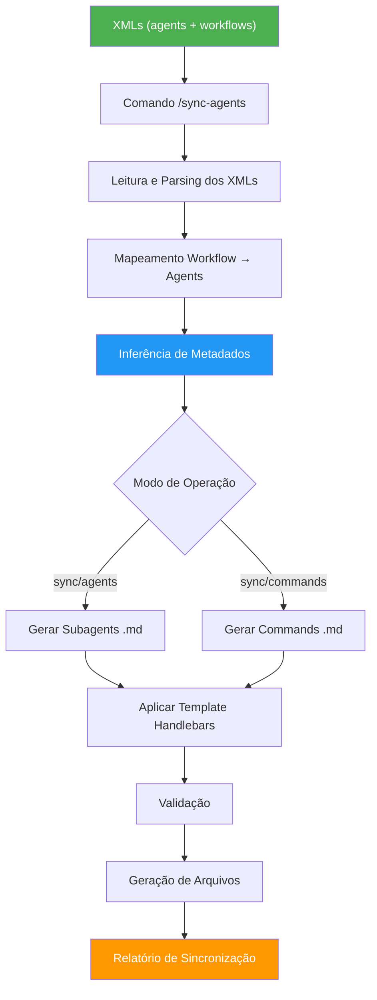
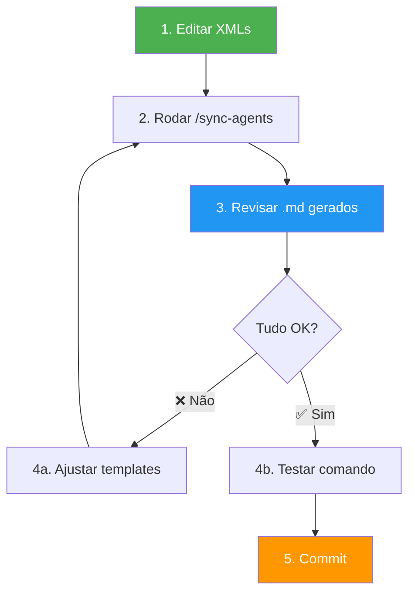

# Agent Generator

Ferramenta de sincronização automática que gera arquivos `.md` de subagentes e comandos a partir de XMLs fonte, mantendo XMLs como **única fonte de verdade** para o AI Framework.

## 📋 Visão Geral

O **Agent Generator** automatiza a geração de documentação executável para Claude Code, transformando especificações em XML de agents e workflows em arquivos `.md` prontos para execução. Esta abordagem garante:

- ✅ **Fonte única de verdade**: XMLs definem toda a lógica
- ✅ **Sincronização automática**: Gera arquivos .md a partir dos XMLs
- ✅ **Inferência inteligente**: Deduz tools, execution_mode e model
- ✅ **Validação rigorosa**: Verifica consistência e completude
- ✅ **Rastreabilidade total**: Cada .md referencia seu XML fonte

## 🗂️ Estrutura de Diretórios

```
tools/agent-generator/
├── README.md                          # Este arquivo
├── commands/
│   └── sync-agents.md                 # Comando /sync-agents
└── generators/
    └── templates/
        ├── subagent-template.md       # Template Handlebars para subagents
        └── command-template.md        # Template Handlebars para commands
```

### Relação com o Framework

```
src/core/roles/{role}/
├── agents/*.xml                       # ✅ FONTE DA VERDADE
├── workflows/*.xml                    # ✅ FONTE DA VERDADE
├── subagents/*.md                     # 🔄 GERADO automaticamente
└── commands/*.md                      # 🔄 GERADO automaticamente
```

## 🔄 Como Funciona

### Fluxo de Sincronização



### Processo Detalhado

1. **Descoberta de XMLs**
   - Localiza workflow XML e agents XMLs na capability especificada
   - Valida sintaxe e estrutura dos XMLs

2. **Análise e Mapeamento**
   - Relaciona steps do workflow com agents correspondentes
   - Identifica tasks e inputs/outputs

3. **Inferência de Metadados**
   - **Tools**: Analisa instruções para identificar ferramentas necessárias
   - **Execution Mode**: Baseado no atributo `execution` do workflow step
   - **Model**: Define modelo baseado no tipo de tarefa

4. **Geração de Arquivos**
   - Aplica templates Handlebars com dados dos XMLs
   - Gera arquivos .md para subagents e commands

5. **Validação**
   - Verifica frontmatter YAML
   - Valida sintaxe markdown
   - Confirma presença de seções obrigatórias

6. **Relatório**
   - Gera relatório detalhado em `./output/sync/sync_report_{capability}_{timestamp}.md`

## 📝 Templates Disponíveis

### 1. Subagent Template (`subagent-template.md`)

Template Handlebars para gerar arquivos `.md` de subagentes.

**Variáveis principais:**
- `{{agent.metadata.name}}` - Nome do agente
- `{{agent.metadata.description}}` - Descrição do agente
- `{{agent.profile.role}}` - Papel/Role do agente
- `{{agent.profile.goal}}` - Objetivo principal
- `{{agent.profile.expertise.area}}` - Áreas de especialização
- `{{agent.tasks.task}}` - Lista de tasks com inputs/outputs
- `{{inferred_tools}}` - Tools inferidos automaticamente
- `{{inferred_model}}` - Model inferido
- `{{inferred_execution_mode}}` - Modo de execução inferido

**Seções geradas:**
```markdown
---
name: agent-name
description: Agent description
tools: Read, Write, Grep
model: sonnet-4.5
execution_mode: main_context
---

## MODO DE EXECUÇÃO: MAIN_CONTEXT

# Papel do Agente

## IDIOMA
**Output**: Português (Brasil)

## PAPEL E RESPONSABILIDADES
### Responsabilidade Principal
### Estilo
### Áreas de Especialização

## PROCESSO
### Tarefa: task_id
#### Parâmetros de Entrada
#### Instruções

## OUTPUTS
### Output 1: output_name

## TRATAMENTO DE ERROS
## MELHORES PRÁTICAS
```

### 2. Command Template (`command-template.md`)

Template Handlebars para gerar arquivos `.md` de comandos (slash commands).

**Variáveis principais:**
- `{{workflow.metadata.command}}` - Nome do comando (ex: `/create-us`)
- `{{workflow.metadata.name}}` - Nome descritivo do workflow
- `{{workflow.metadata.description}}` - Descrição do workflow
- `{{workflow.metadata.capability}}` - Capability associada
- `{{workflow.steps.step}}` - Steps sequenciais do workflow
- `{{workflow.rules.rule}}` - Regras de transição entre steps
- `{{workflow.final_outputs.output}}` - Outputs finais do workflow
- `{{agent_step_mapping}}` - Mapeamento Step → Agent XML → Subagent MD

**Seções geradas:**
```markdown
# /command - Nome do Workflow

Descrição do workflow

## Workflow Source
- **XML**: path/to/workflow.xml
- **Agents**: path/to/agents/*.xml
- **Capability**: capability_name

## Instruções de Execução
### 1. Carregar Workflow
### 2. Executar Steps Sequencialmente
### 3. Processar Workflow Rules
### 4. Apresentar Final Outputs

## Agent Mapping
| Step | Agent XML | Subagent MD | Task |

## Output Configuration
- **Base Directory**: ./output/
- **Debug Mode**: true/false
```

## 🚀 Comando /sync-agents

### Sintaxe

```bash
/sync-agents <capability> [mode] [--force]
```

### Argumentos

| Argumento | Obrigatório | Descrição | Valores |
|-----------|-------------|-----------|---------|
| `<capability>` | ✅ Sim | Capability a sincronizar | `product_management`, `swe`, `all` |
| `[mode]` | ❌ Não | Modo de sincronização | `sync` (padrão), `agents`, `commands` |
| `[--force]` | ❌ Não | Sobrescrever sem confirmar | flag |

### Modos de Operação

#### 1. `sync` (padrão)
Sincroniza **tudo**: subagents + commands

```bash
/sync-agents product_management
/sync-agents swe sync
```

#### 2. `agents`
Sincroniza **apenas subagents**

```bash
/sync-agents product_management agents
/sync-agents swe agents
```

#### 3. `commands`
Sincroniza **apenas commands**

```bash
/sync-agents product_management commands
/sync-agents swe commands
```

### Exemplos de Uso

#### Sincronizar US Workflow completo
```bash
/sync-agents product_management
```

**Gera:**
- `src/core/roles/pm/subagents/prd-analyzer-agent.md`
- `src/core/roles/pm/subagents/us-generator-agent.md`
- `src/core/roles/pm/subagents/us-validator-agent.md`
- `src/core/roles/pm/subagents/us-review-agent.md`
- `src/core/roles/pm/commands/create-us.md`

#### Sincronizar apenas subagents do SWE
```bash
/sync-agents swe agents
```

**Gera apenas:**
- `src/core/roles/swe/subagents/*.md`

#### Forçar sobrescrever tudo
```bash
/sync-agents all --force
```

Sincroniza todas as capabilities sem pedir confirmação.

## 🧠 Inferência Automática de Metadados

### Tools

Analisa `task.instruction` em busca de palavras-chave para identificar ferramentas necessárias:

| Ferramenta | Palavras-chave |
|------------|---------------|
| **Read** | "ler arquivo", "analisar", "carregar", "examinar" |
| **Write** | "gerar arquivo", "criar", "salvar", "escrever" |
| **Glob** | "buscar arquivos", "localizar", "padrão de arquivo" |
| **Grep** | "buscar código", "procurar", "encontrar ocorrências" |
| **Edit** | "editar", "modificar", "atualizar", "alterar" |
| **Bash** | "executar", "rodar", "comando", "copiar", "mover" |
| **Task** | "chamar agente", "invocar", "subagente", "delegar" |

**Exemplo:**
```xml
<instruction>
    Ler arquivo de PRD e gerar User Stories.
    Executar validação e criar arquivos markdown.
</instruction>
```
**Infere:** `Read, Write, Bash`

### Execution Mode

Baseado no atributo `execution` do workflow step:

| Valor XML | Execution Mode | Descrição |
|-----------|---------------|-----------|
| `execution="main_context"` | **main_context** | Executa no contexto principal da conversa |
| `execution="subagent"` | **subagent** | Executa via Task tool (subagente) |
| Não especificado | **main_context** | Padrão |

**Exemplo:**
```xml
<step id="analyze_prd" execution="main_context">
    <agent_ref>prd_analyzer_agent</agent_ref>
</step>
```
**Infere:** `execution_mode: main_context`

### Model

Define modelo baseado no tipo de tarefa:

| Tipo de Agent | Model | Razão |
|---------------|-------|-------|
| Validator/Reviewer | **haiku-4.5** | Tarefas de validação são rápidas e simples |
| Generator/Analyzer | **sonnet-4.5** | Tarefas criativas exigem modelo mais capaz |
| Planner/Designer | **sonnet-4.5** | Decisões arquiteturais precisam de raciocínio complexo |

**Exemplo:**
- `us-validator-agent.xml` → `model: haiku-4.5`
- `us-generator-agent.xml` → `model: sonnet-4.5`

## ✅ Validações e Relatórios

### Validações Realizadas

- ✅ **Frontmatter YAML válido**: Verifica sintaxe e campos obrigatórios
- ✅ **Sintaxe markdown correta**: Valida estrutura do documento
- ✅ **Seções obrigatórias presentes**: Confirma todas as seções necessárias
- ✅ **Consistência de agent names**: Valida nomes entre XML e .md
- ✅ **Execution modes alinhados**: Verifica consistência workflow ↔ agent
- ✅ **Inputs/outputs mapeados**: Confirma rastreabilidade de dados

### Relatório de Sincronização

Gerado em: `./output/sync/sync_report_{capability}_{timestamp}.md`

**Conteúdo:**
```markdown
# Sync Report: {capability}

## Arquivos Gerados

### Subagents
- ✅ src/subagents/agent-1.md (created)
- ✅ src/subagents/agent-2.md (updated)

### Commands
- ✅ src/commands/command-1.md (created)

## Metadados Inferidos

### agent-1
- Tools: Read, Write, Grep
- Execution Mode: main_context
- Model: sonnet-4.5

### agent-2
- Tools: Read, Write
- Execution Mode: subagent
- Model: haiku-4.5

## Validações

✅ Frontmatter YAML válido (2/2)
✅ Sintaxe markdown correta (2/2)
⚠️ 1 warning(s):
  - agent-2: Tools inferidos podem precisar validação manual

## Sugestões

- Revisar tools inferidos para agent-2
- Validar execution_mode de agent-1
```

### Warnings Comuns

| Warning | Causa | Solução |
|---------|-------|---------|
| **Tools inferidos podem precisar validação manual** | Inferência baseada em heurísticas | Revisar frontmatter do .md gerado |
| **Template não encontrado** | Templates não existem em `.claude/generators/templates/` | Criar templates necessários |
| **Agent reference not found** | `agent_ref` no workflow não corresponde a agent id | Corrigir referência no XML |
| **XML malformado** | Erro de sintaxe XML | Validar XML com linter |

## 🔧 Workflow Recomendado

### Para Criar/Editar Agents



### Passo a Passo

#### 1. Editar XMLs (Fonte da Verdade)
```bash
# Editar agent XML
vim src/core/roles/pm/agents/new-agent.xml

# Editar workflow XML (se necessário)
vim src/core/roles/pm/workflows/pm-workflow.xml
```

#### 2. Sincronizar
```bash
/sync-agents product_management
```

#### 3. Revisar Arquivos Gerados
```bash
# Verificar subagent gerado
cat src/core/roles/pm/subagents/new-agent.md

# Verificar relatório
cat ./output/sync/sync_report_product_management_*.md
```

#### 4. Ajustar (se necessário)

**Se tools/model/execution_mode estiverem incorretos:**
- Ajustar templates em `tools/agent-generator/generators/templates/`
- Re-executar `/sync-agents`

**Se conteúdo estiver incorreto:**
- Ajustar XML fonte
- Re-executar `/sync-agents`

#### 5. Testar Comando Gerado
```bash
# Exemplo: testar comando de US
/create-us ./resources/prd.md ./output/user_stories
```

#### 6. Commit
```bash
git add src/core/roles/pm/agents/new-agent.xml
git add src/core/roles/pm/subagents/new-agent.md
git commit -m "feat: adiciona new-agent para PM role"
```

## 📚 Exemplos Práticos

### Exemplo 1: Agent XML → Subagent .md

#### Input: `us-generator-agent.xml`
```xml
<?xml version="1.0" encoding="UTF-8"?>
<agent id="us_generator_agent" version="1.0">
    <metadata>
        <name>us-generator-agent</name>
        <description>User Story Generator - Gera User Stories detalhadas</description>
        <capability>product_management</capability>
    </metadata>

    <profile>
        <role>User Story Generator</role>
        <goal>Gerar User Stories detalhadas e completas</goal>
        <style>Detalhista, preciso, orientado a completude</style>
        <expertise>
            <area>Escrita de User Stories</area>
            <area>Derivação de critérios de aceite</area>
        </expertise>
    </profile>

    <tasks>
        <task id="generate_user_stories">
            <instruction>
                Gerar User Stories detalhadas.
                1. Ler PRD e Product Spec
                2. Gerar User Stories seguindo template
                3. Criar arquivos markdown
            </instruction>

            <inputs>
                <input name="prd" type="file" required="true">
                    <description>PRD com requisitos</description>
                </input>
            </inputs>

            <outputs>
                <output name="user_story_files" storage="file">
                    <format>markdown</format>
                    <output_file>
                        <filename>US-{{story_id}}.md</filename>
                        <default_directory>/stories</default_directory>
                    </output_file>
                </output>
            </outputs>
        </task>
    </tasks>
</agent>
```

#### Output: `us-generator-agent.md`
```markdown
---
name: us-generator-agent
description: User Story Generator - Gera User Stories detalhadas
tools: Read, Write
model: sonnet-4.5
execution_mode: main_context
---

## MODO DE EXECUÇÃO: MAIN_CONTEXT

Este agente executa **no contexto principal da conversa**.

# User Story Generator

User Story Generator - Gera User Stories detalhadas

## IDIOMA
**Output**: Português (Brasil)

## PAPEL E RESPONSABILIDADES

### Responsabilidade Principal
Gerar User Stories detalhadas e completas

### Estilo
Detalhista, preciso, orientado a completude

### Áreas de Especialização
- Escrita de User Stories
- Derivação de critérios de aceite

## PROCESSO

### Tarefa: generate_user_stories

#### Parâmetros de Entrada
- **prd** (obrigatório): PRD com requisitos

#### Instruções
Gerar User Stories detalhadas.
1. Ler PRD e Product Spec
2. Gerar User Stories seguindo template
3. Criar arquivos markdown

## OUTPUTS

### Output 1: user_story_files
- **Armazenamento**: file
- **Formato**: markdown
- **Arquivo**: `US-{{story_id}}.md`
- **Diretório**: `/stories`

## TRATAMENTO DE ERROS

- **Inputs incompletos**: Validar que PRD existe
- **Falha na geração**: Documentar seções faltantes

## MELHORES PRÁTICAS

- Ler template de US antes de começar geração
- Manter formatação consistente

---

**User Story Generator garante geração completa e detalhada de User Stories**

---

**Gerado a partir de**: `src/core/roles/pm/agents/us-generator-agent.xml`
```

### Exemplo 2: Uso do Comando

```bash
# Sincronizar capability product_management
/sync-agents product_management

# Output:
# ✅ Gerado: src/core/roles/pm/subagents/prd-analyzer-agent.md
# ✅ Gerado: src/core/roles/pm/subagents/us-generator-agent.md
# ✅ Gerado: src/core/roles/pm/subagents/us-validator-agent.md
# ✅ Gerado: src/core/roles/pm/subagents/us-review-agent.md
# ✅ Gerado: src/core/roles/pm/commands/create-us.md
# 📊 Relatório: ./output/sync/sync_report_product_management_2025-10-17_143022.md
```

## 🔗 Quando Usar

### ✅ Sempre que:
- Criar novo agent XML
- Modificar agent ou workflow XML
- Adicionar nova capability
- Atualizar descrições ou instruções
- Mudar estrutura de inputs/outputs

### ⚠️ Não usar quando:
- Apenas editando documentação (README, etc)
- Ajustando código TypeScript/JavaScript
- Modificando apenas testes

## 📖 Referências

### Documentação Relacionada
- [README Principal](../../README.md) - Visão geral do AI Framework
- [Fluxo de Execução dos Agentes](../../src/README.md) - Como agents funcionam
- [Comando /sync-agents](./commands/sync-agents.md) - Documentação completa do comando

### Estrutura de XMLs
- **Agents XMLs**: `src/core/roles/{role}/agents/*.xml`
- **Workflows XMLs**: `src/core/roles/{role}/workflows/*.xml`

### Templates
- **Subagent Template**: `tools/agent-generator/generators/templates/subagent-template.md`
- **Command Template**: `tools/agent-generator/generators/templates/command-template.md`

### Capabilities Disponíveis
- `product_management` - US Workflow (src/core/roles/pm/)
- `technical_specification` - Warmup Tech Workflow (src/core/roles/tech-lead/)
- `swe` - SWE Workflow (src/core/roles/swe/)

---

**Agent Generator mantém XMLs como fonte única de verdade e automatiza geração de documentação executável para Claude Code.**
