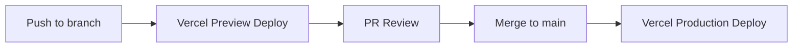

# Technical Specification (Warmup Tech)

## Current Technical State

### Existing System Analysis

- **Greenfield project** — sem sistema legado, sem débito técnico, sem migração
- Stack já scaffolded: Next.js 16.1.6 (App Router), React 19.2.3, TypeScript 5 (strict), Tailwind CSS 4, shadcn/ui (Radix Maia, Cyan theme)
- Componentes UI prontos: Button, Card, Input, Select, Combobox, Badge, AlertDialog, DropdownMenu, Field, Label, Separator, Textarea
- Font system configurado: Outfit (sans) + Geist Mono
- Icons: @remixicon/react 4.9.0
- Estado atual: demo page com component gallery — nenhuma feature de produto implementada

### Codebase Analysis Results

**Stack e Dependências**
- TypeScript 5 com strict mode habilitado
- Next.js 16.1.6 com App Router (RSC habilitado)
- React 19.2.3 + React DOM 19.2.3
- Tailwind CSS 4 via @tailwindcss/postcss (CSS-first config, sem tailwind.config.js)
- shadcn/ui com Radix Maia style — componentes em `components/ui/`
- class-variance-authority 0.7.1 + clsx 2.1.1 + tailwind-merge 3.4.0
- tw-animate-css 1.4.0 para animações
- **Pendente de instalação:** Zustand (state management definido no projeto, não instalado)

**Arquitetura e Organização**
- Single-repo, frontend-only
- Path alias: `@/*` mapeado para root
- Componentes UI em `components/ui/` (shadcn, não modificar diretamente)
- Utility: `lib/utils.ts` com `cn()` helper
- Theming via CSS custom properties em `app/globals.css` (oklch color space)
- ESLint 9 flat config com next/core-web-vitals + next/typescript

**Testing e Deploy**
- Nenhum framework de teste instalado (a definir)
- Build: `next build` (padrão)
- Deploy target: Vercel

### Architecture Diagrams

```mermaid
graph TD
    subgraph "Client (Browser)"
        A[Next.js App Router] --> B[React Server Components]
        A --> C[Client Components]
        C --> D[Zustand Store]
        D --> E[localStorage]
    end

    subgraph "Pages"
        P1[/ — Dashboard]
        P2[/history — Histórico]
        P3[/settings — Configurações]
    end

    subgraph "State Layer"
        D --> S1[hydrationStore]
        S1 --> S1a[logs: HydrationLog\[\]]
        S1 --> S1b[dailyGoal: number]
        S1 --> S1c[streak: number]
        S1 --> S1d[reminders: ReminderConfig]
    end

    A --> P1
    A --> P2
    A --> P3
```

### Legacy Dependencies and Technical Debt

- **N/A** — greenfield, sem legado
- `ai-framework-bossabox-labs` listado como dependência runtime no package.json — avaliar se deve ser devDependency ou removido do bundle de produção

## Technical Context and Scope

### Technical Context

- **Requisito de negócio:** registro de hidratação em < 3 segundos, visualização de progresso, streaks, histórico
- **Premissa fundamental:** local-first — todos os dados vivem no localStorage do browser, sem backend, sem auth
- **Limitação conhecida:** localStorage tem limite de ~5MB por origem; suficiente para anos de logs de hidratação (cada log ~100 bytes)
- **Escopo técnico MVP:** 3 rotas (dashboard, history, settings), 1 store Zustand com persistência, componentes de UI para quick log + progress ring + streak + history chart
- **Sem API routes** no MVP — toda lógica é client-side
- **PWA consideration:** não incluído no MVP, mas a arquitetura não deve impedir adição futura de Service Worker + manifest

## Non-Functional Requirements

### Performance

- **First Contentful Paint:** < 1.5s em 4G
- **Lighthouse Performance:** > 95 (meta do projeto)
- **Bundle size:** < 100KB gzipped (meta do projeto)
- **Interação de log:** < 3 segundos do toque ao feedback visual (meta de produto)
- **Otimizações:** Static generation para shell das páginas, dynamic imports para componentes pesados (charts), Tailwind CSS purge automático via v4
- **Resource:** localStorage como única I/O — sem network latency para dados do usuário

### Security

- **Autenticação:** N/A no MVP (sem contas)
- **Dados sensíveis:** dados de hidratação ficam exclusivamente no device do usuário (localStorage)
- **Validação:** input validation no client para valores de volume (número positivo, range razoável 1ml–5000ml)
- **Headers:** configurar Content-Security-Policy, X-Frame-Options, X-Content-Type-Options via next.config.ts
- **Dependências:** manter `npm audit` limpo; dependências mínimas

### Reliability

- **Disponibilidade:** Vercel edge network (99.99% para assets estáticos)
- **Dados locais:** localStorage persiste entre sessões, mas é volátil (clear browser data = perda). Documentar isso para o usuário
- **Error handling:** graceful fallback se localStorage estiver indisponível (modo incógnito em alguns browsers); exibir aviso, não crashar
- **Data integrity:** validação de schema ao ler do localStorage — se dados estão corrompidos, resetar com aviso

### Accessibility

- **WCAG AA** compliance (meta do projeto)
- **Semantic HTML:** usar elementos nativos antes de ARIA; shadcn/ui já fornece base acessível via Radix
- **Touch targets:** mínimo 44x44px (meta do projeto) — crítico para quick log buttons
- **Contraste:** oklch theme com contraste verificado; dark mode obrigatório com `prefers-color-scheme` media query
- **Keyboard:** navegação completa via teclado; focus ring visível; skip link para conteúdo principal
- **Motion:** respeitar `prefers-reduced-motion` para animações do progress ring e transições

### Compliance

- **LGPD/GDPR:** N/A no MVP — dados ficam exclusivamente no device do usuário, sem coleta, sem tracking, sem analytics
- **Se/quando analytics for adicionado:** necessário consent banner e política de privacidade

## Macro Architecture & Infrastructure Planning

### Architectural Vision

**Estilo:** Single-Page Application com Static Shell + Client-Side Hydration

**Componentes principais:**

| Camada | Responsabilidade |
|--------|-----------------|
| Pages (RSC shell) | Layout estático, metadata, estrutura |
| Client Components | UI interativa, event handlers, state binding |
| Zustand Store | Estado global da aplicação com persistência localStorage |
| Domain Logic | Cálculos de streak, progresso diário, agregações de histórico |

**Fluxo de dados:**
1. App carrega shell estático (RSC) — fast paint
2. Client components hydrate e lêem Zustand store (que rehydrata do localStorage)
3. Ações do usuário (log water, configurar meta) escrevem no store
4. Zustand middleware persiste automaticamente no localStorage
5. UI reage via selectors (re-render granular)

**Estrutura de rotas:**

| Rota | Tipo | Conteúdo |
|------|------|----------|
| `/` | Dashboard | Quick log, progress ring, streak, resumo do dia |
| `/history` | Visualização | Gráficos semanais/mensais, tendências |
| `/settings` | Configuração | Meta diária, presets de volume, reminders |

## Security Patterns

### Mandatory Patterns

- **Sem backend = superfície de ataque mínima** — sem API keys, sem secrets, sem database credentials
- **Content Security Policy:** `default-src 'self'`; ajustar para fonts e assets conforme necessário
- **Subresource Integrity:** habilitado para assets externos (se houver)
- **Dependências:** manter número mínimo de dependências runtime; auditar com `npm audit` antes de cada release

## Code Patterns and File Structure

### Engineering Best Practices

**Estrutura de diretórios (target):**
```
app/
├── layout.tsx              # Root layout (fonts, metadata, providers)
├── page.tsx                # Dashboard (quick log + progress + streak)
├── history/
│   └── page.tsx            # History view
├── settings/
│   └── page.tsx            # Settings
└── globals.css             # Theme + Tailwind

components/
├── ui/                     # shadcn/ui (NÃO modificar diretamente)
├── dashboard/              # Quick log, progress ring, streak card
├── history/                # Charts, trend cards
├── settings/               # Goal config, reminder config, presets
└── layout/                 # Shell, navigation, bottom bar

hooks/
├── use-hydration-store.ts  # Zustand store + selectors
├── use-daily-progress.ts   # Derived: progresso do dia atual
├── use-streak.ts           # Derived: cálculo de streak
└── use-reminders.ts        # Web Push API integration

lib/
├── utils.ts                # cn() helper (existente)
├── constants.ts            # Presets padrão, limites, keys
└── types.ts                # Domain types (HydrationLog, DailyGoal, etc.)
```

**Convenções de código:**
- Named exports apenas (sem default exports, exceto pages do Next.js)
- Props interfaces: `[Component]Props` (ex: `QuickLogButtonProps`)
- Componentes shadcn/ui: usar via wrappers, nunca modificar `components/ui/` diretamente
- Um componente por arquivo; co-locate testes junto ao componente
- `"use client"` directive explícita em todo componente que usa hooks/state/events

**Testing strategy:**
- **Unit:** Vitest para lógica de domínio (streak calculation, daily aggregation, store actions)
- **Component:** React Testing Library para componentes interativos
- **E2E:** Playwright para fluxos críticos (log water → progress updates → streak increments)
- **Cobertura alvo:** 80% para lógica de domínio (hooks + lib), pragmático para UI

## Technologies and Tools

### Technology Stack

| Camada | Tecnologia | Versão | Nota |
|--------|-----------|--------|------|
| Runtime | React | 19.2.3 | Server + Client Components |
| Framework | Next.js | 16.1.6 | App Router, RSC |
| Language | TypeScript | 5.x | strict mode |
| Styling | Tailwind CSS | 4.x | CSS-first, oklch colors |
| Components | shadcn/ui | Radix Maia | Cyan theme |
| Icons | Remix Icon | 4.9.0 | @remixicon/react |
| State | Zustand | ^5.0 | **A instalar** — com persist middleware |
| Fonts | Outfit + Geist Mono | — | Via next/font |
| Animations | tw-animate-css | 1.4.0 | Tailwind-native |
| Test (unit) | Vitest | latest | **A instalar** |
| Test (component) | React Testing Library | latest | **A instalar** |
| Test (E2E) | Playwright | latest | **A instalar** |
| Lint | ESLint | 9.x | Flat config, next/core-web-vitals |
| Deploy | Vercel | — | Zero-config Next.js deploy |
| Package Manager | npm | — | lockfile existente |

**Branching strategy:** trunk-based — `main` como branch de produção, feature branches curtas com PR para main

## Observability

### Monitoring and Metrics

- **MVP:** sem observability infrastructure — app é client-side only, sem backend para instrumentar
- **Vercel Analytics:** considerar habilitação futura para Web Vitals (LCP, FID, CLS) — não incluído no MVP para manter bundle lean
- **Error tracking:** `console.error` + boundaries do React (ErrorBoundary) para capturar crashes no client
- **Métricas de produto** (streak, retention) são calculadas localmente — sem tracking server-side no MVP

## External Integrations & Dependencies

### External Systems

- **Web Push API** (browser nativo) — para reminders de hidratação; sem serviço externo, usa Notification API do browser
- **Nenhuma API externa** no MVP — zero dependência de serviços terceiros
- **Nenhum banco de dados** — localStorage como única persistência

## Environments (Dev, Staging, Prod, etc.)

### Environment Definition

| Ambiente | URL | Propósito |
|----------|-----|-----------|
| Dev | `localhost:3000` | Desenvolvimento local com hot reload |
| Preview | `*.vercel.app` | Gerado automaticamente por PR via Vercel |
| Prod | TBD (custom domain ou vercel.app) | Build otimizado, CDN global |

- **Sem staging dedicado** — Vercel preview deployments cumprem esse papel
- **Sem variáveis de ambiente** no MVP (sem secrets, sem API keys)
- **Test data:** N/A — dados são locais ao browser do desenvolvedor

## Deployment Flow & Continuous Delivery (CI/CD)

### Deployment Pipeline



- **CI:** Vercel automatic builds — lint + type-check + build em cada push
- **Tests in pipeline:** adicionar `npm test` (Vitest) como check obrigatório após setup
- **Rollback:** Vercel instant rollback para deploy anterior via dashboard
- **Sem IaC** — Vercel gerencia infraestrutura; zero config servers

---

## Information Sources

### Documents Analyzed

- `warmup-product.md` — Product spec (status: completed)
- `warmup-project.md` — Project config (status: completed)
- `package.json` — Dependências e scripts
- `tsconfig.json` — TypeScript configuration
- `eslint.config.mjs` — Lint rules
- `postcss.config.mjs` — PostCSS/Tailwind setup
- `components.json` — shadcn/ui configuration
- `app/globals.css` — Theme variables e design tokens
- `app/layout.tsx` — Root layout e font configuration
- `components/ui/*.tsx` — 14 componentes shadcn instalados

### Codebase Analysis

- **Codebases analisados:** `./` (root — single-repo frontend)
- **Total de arquivos de código:** ~20 (excluindo node_modules)
- **Linguagens:** TypeScript (100%)
- **Frameworks:** Next.js 16, React 19, Tailwind CSS 4, Radix UI

### External References

- Next.js App Router: https://nextjs.org/docs/app
- Zustand: https://zustand.docs.pmnd.rs/
- shadcn/ui: https://ui.shadcn.com/
- Web Push API: https://developer.mozilla.org/en-US/docs/Web/API/Push_API
- Vitest: https://vitest.dev/
